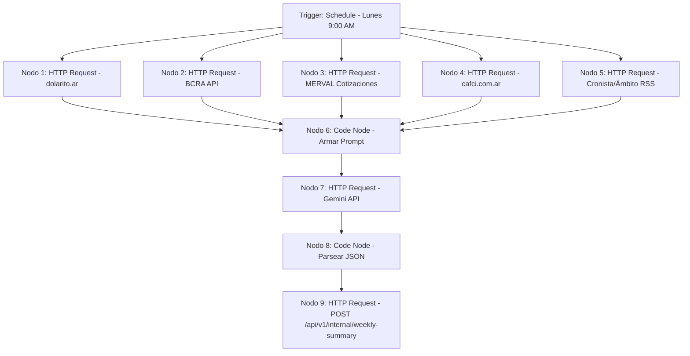

# Invertite — Workflow N8N: Generación del Resumen Semanal IA

Este documento describe la estructura del workflow programado en N8N para recolectar datos financieros e invocar a Gemini API para generar el resumen semanal de Invertite.

## Detalles del Workflow

*   **Nombre**: `invertite-resumen-semanal`
*   **Frecuencia (Trigger)**: Todos los lunes a las 9:00 AM (Hora de Argentina).

---

## Estructura de Nodos



### 1. Nodos de Recolección de Datos (Nodos 1 a 5)
Realizan peticiones HTTP GET a las fuentes de datos del mercado financiero argentino:
*   **Dólares**: `dolarito.ar` para precios y brecha MEP/CCL.
*   **Tasas de interés**: BCRA para Tasa de Política Monetaria y cauciones promedio.
*   **Acciones y bonos**: Rava/IOL para índices MERVAL.
*   **Fondos Comunes (FCI)**: `cafci.com.ar` para rendimientos de fondos money market.
*   **Headlines**: Noticias destacadas de portales como El Cronista o Ámbito Financiero.

### 2. Nodo 6: Code Node (Preparar Prompt)
Agrupa las respuestas de los nodos de datos y construye un prompt unificado estructurado para el LLM.

### 3. Nodo 7: HTTP Request (Gemini API)
Llamada POST a la API de Google Gemini utilizando el modelo `gemini-2.0-flash`.
*   **System Prompt**:
    ```text
    Sos el editor financiero de Invertite, una plataforma para inversores argentinos principiantes. 
    Escribís en español rioplatense, sin jerga técnica innecesaria, con datos concretos y ejemplos cotidianos.
    Generá el resumen semanal del mercado argentino en formato JSON exactamente con esta estructura:
    {
      "headline": "...",
      "intro": "...",
      "sections": [
        {
          "title": "...",
          "body": "...",
          "instruments": ["..."],
          "sentiment": "positive | neutral | negative"
        }
      ],
      "tip_of_week": "...",
      "market_data_snapshot": {
        "mep": number,
        "ccl": number,
        "merval": number,
        "caucion_tna": number
      }
    }
    ```
*   **User Message**: Pasa los datos consolidados y la fecha de inicio de semana (`week_start`).

### 4. Nodo 8 & 9: Publicación en el Backend
*   El nodo de código limpia cualquier bloque markdown de la respuesta de Gemini (como ```json...```).
*   El Nodo 9 hace una llamada HTTP POST a `http://localhost:3001/api/v1/internal/weekly-summary` adjuntando el JSON en el cuerpo del request y enviando la cabecera `X-Internal-Key` con la clave compartida definida en las variables de entorno.
